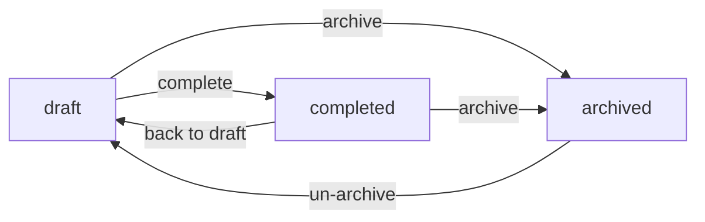

# ADR-001: User roles and project workflow

## Context

The application should limit access to API endpoints and client pages based on the user-assigned role or permissions. Authenticated users will be managing projects and should have the ability to transition them through different states. It should be possible to execute arbitrary actions whenever a project transition occurs, such as sending an email, calling a third-party service, etc. Both the permission and workflow features should be designed to allow for extension on a project-specific basis.

## Decision

Given the requirements, it was decided to use [Flask Principal](https://pythonhosted.org/Flask-Principal/) for the user role-permission system. The system will include the following roles: `Authenticated`, `Scientist`, and `Admin`.

Table of roles and permissions:

| Role          | View Projects | Edit Projects | View Users | Edit Users |
|---------------|---------------|---------------|------------|------------|
| Admin         | Yes           | Yes           | Yes        | Yes        |
| Scientist     | Yes           | Yes           | No         | No         |
| Authenticated | Yes           | No            | No         | No         |

The [transitions](https://pypi.org/project/transitions/) package will be used for the workflow management.

The project workflow will include the following states:

* `draft` - work-in-progress project, edits allowed
* `completed` - completed project, no edits allowed
* `archived` - archived or obsolete project, no edits allowed

Transitions between states are as follows:

All edits and transitions will be logged in the CloudWatch log group.

These packages are well-documented, follow industry standards, and are widely used, making them a reliable basis for the system.

## Status

- [x] Proposed on 2024-05-28
- [x] Approved on 2024-05-29

## Consequences

* Dependency on the `Flask-Principal` and `transitions`.
