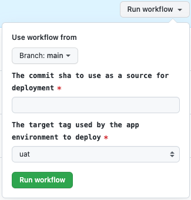

# Lambda R Stack - Init

## Initialization for the new application

The `stage` environment must be provisioned first when initializing the new application.

1. Go to https://github.com/JeremyDemers/the-sink/actions/workflows/stacks--init--lambda-r.yml and click `Run workflow`:

   

    * `The machine-name of the app` should equal the name on the newly created repository (e.g. `smart-lab-web-test-r`).
    * `The machine-name of the app environment` keep the default value `stage`.

   Initialization of the AWS CloudFormation stack will be started. The progress can be seen in the AWS Management Console. Wait until the task is finished.

2. Create new repository with the name `smart-lab-web-<PROJECT_NAME>` (`smart-lab-web-` is required prefix) in GTheSink R&D organization (https://github.com/JeremyDemers). Example: `the-sink-web-uv-report-r`, `smart-lab-web-test-r`.

3. Initialize the new repository with all the contents from the https://github.com/JeremyDemers/the-sink. Example if new repository is called `the-sink-test-r`:

   ```shell
   git clone git@github.com:JeremyDemers/the-sink.git
   cp -R smart-lab-web-uv-report smart-lab-web-test-r
   rm -rf ./smart-lab-web-test-r/.git
   cd smart-lab-web-test-r
   ```

   Then follow the guide [Adding a local repository to GitHub using Git](https://docs.github.com/en/get-started/importing-your-projects-to-github/importing-source-code-to-github/adding-locally-hosted-code-to-github#adding-a-local-repository-to-github-using-git).

4. Wait until all the tasks (`CI/changes`, `CI/deploy_common`, `CI/deploy`) are finished.

   

## Initialization of the additional environment for the application

Each application can have more than one environment. The standard list of environments allowed by the platform:

* `stage`
* `uat`
* `prod`

The environment `stage` is required and is the first environment provisioned for the application. Environments `uat` and `prod` can be provisioned in the later stages of the project. Unlike the `stage` environment, `uat` and `prod` will not be automatically updated with the latest changes from the `main` branch.

To initialize an additional environment follow the steps below.

1. Go to https://github.com/JeremyDemers/the-sink/actions/workflows/stacks--init--lambda-r.yml and click `Run workflow`:

   

    * `The machine-name of the app` should equal the name on the newly created repository (e.g. `smart-lab-web-test-r`).
    * `The machine-name of the app environment` select `uat` or `prod`.

   Initialization of the AWS CloudFormation stack will be started. The progress can be seen in the AWS Management Console. Wait until the task is finished.

2. In the repository of your project go to `Actions`->`Deploy` (e.g. https://github.com/JeremyDemers/the-sink/actions/workflows/deploy.yml) and click `Run workflow`:

   

    * `The commit sha to use as a source for deployment` copy the SHA of the commit from the `main` branch to specify the version to deploy (in most cases, it would be the latest commit).
    * `The target tag used by the app environment to deploy` select `uat` or `prod`, should be the same as in step 1.

   Wait until the task is finished.
