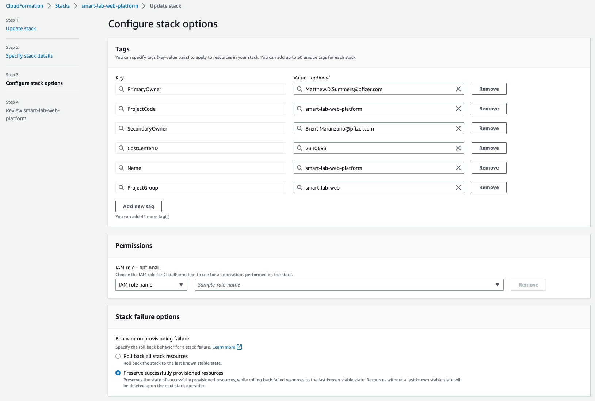
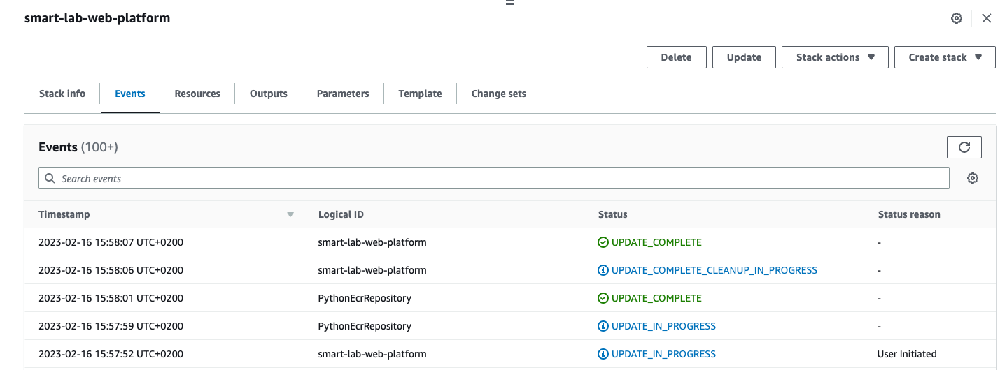

# Platform Stack

## Description

Platform Stack defines resources necessary for the operation of the Smart Lab Web Platform as a whole and includes:

* Logs S3 Bucket - to keep the S3 access logs.
* Pipeline S3 Bucket  - to upload the source code from repositories and then deploy it to the AWS environment.
* ECR repository for Python runtime - to store base Docker images for all applications that use Python runtime.
* ECR repository for Lambda R runtime - to store base Docker images for all Lambda functions that use R runtime.
* Cognito User Pool - to serve as an Authorizer for Lambda functions.
* Role for GitHub Workflows - to allow interaction between GitHub and AWS.
* Role for CloudFormation - to provision resources in the AWS with CloudFormation on behalf of the applications.

## Update

**Modifications to this stack affect all applications and should be made cautiously.**

### Prerequisites

* The user has to have access to the AWS Management Console of the account `dev-pssmsmartlab-rapid (791707043329)`.
* The user's role should allow performing updates to the CloudFormation Stacks.

### Steps

1. Log in to the AWS Management Console via http://awsprodv2.thesink.com/ and select a corresponding role.
2. Go to the `CloudFormation` service and find the `smart-lab-web-platform` stack.
3. Click `Update`, `Replace current template`, and `Upload a template file`.

   
4. Click `Choose file`, use the file browser to locate the `cfn-template.yml` file, and hit `Next`.
5. `Parameters` values usually should not be modified unless a specific need or a new parameter is added. Hit `Next`.

   
6. Again, no values need modification unless a specific need exists. So feel free to hit `Next`.

   

   
7. Scroll the overview page to the bottom. There you will see the preview of the changes that will be applied. You'll have to give your consent to use described `Capabilities`.

   
8. Hit the `Submit` button if the overview looks good. That will initiate the stack update, which progress can be seen in the `Events` tab.

   
