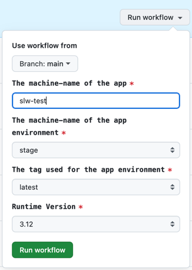

# Python Stack - Deploy

Whenever changes are merged to the `main` branch, the `CI` workflow is rerun to ensure changes were merged correctly. If the `CI` step is successful, the `Deploy` workflow is initiated, during which:

* The `client` part of the application is built with the `npm run build` command.
* The source code of the application is packed into the two archives (`<commit_sha>.zip` and `latest.zip`) and uploaded to the [Pipeline S3 Bucket](../../platform).

The archive named `latest.zip` always has the latest version of the code and is used for `stage` deployments.
The archive named `<commit_sha>.zip` will be used for deploying a specific version to the `uat` or `prod` environments.

From this point, further deployment is taken care of by the AWS CodePipeline.

## Stage

As mentioned above, the AWS CodePipeline is doing the job to update the instance in the cloud.

* `Source` step monitors the changes to the `latest.zip`, and whenever the new version is uploaded, the pipeline is started.
* `Build` step, in a nutshell, performs `docker build` and pushes the image to the private image repository ([more details](/aws/buildspec.yaml)).
* `Deploy` does two things:
    * Updates the CloudFormation stack of the application to ensure changes to the [cfn-template.yml](/aws/cfn-template.yml) are applied.
    * Starts a Docker container with the new version of the image and stops the previous one in the AWS ECS.

More details about the CodePipeline and its configuration can be found here [config](../config)

## UAT and Prod

Unlike the `stage` environment, `uat` and `prod` will not be automatically updated with the latest changes from the `main` branch. The `uat` and `prod` environments have similar to the `stage` CodePipeline, which checks for a new version of `uat.zip` and `prod.zip` accordingly.

To trigger the deployment in the repository of your project, go to `Actions`->`Deploy` (e.g. https://github.com/JeremyDemers/the-sink/actions/workflows/deploy.yml) and click `Run workflow`:

* `The commit sha to use as a source for deployment` copy the SHA of the commit from the `main` branch to specify the version to deploy (in most cases, it would be the latest commit).
* `The target tag used by the app environment to deploy` select `uat` or `prod`.

This action will create a copy of the archive `<commit_sha>.zip` with the name `uat.zip` or `prod.zip` and so trigger the pipeline.

## Side note

The definition of the archive name pipeline of each environment monitors is specified by the field `The tag used for the app environment` on initialization. While you would usually want to use it in a default way, it is technically possible for multiple environments to monitor the same `tag` and, this way, be in sync.

