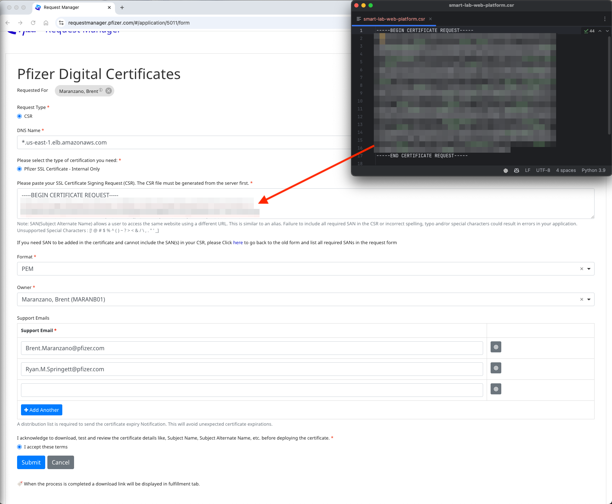
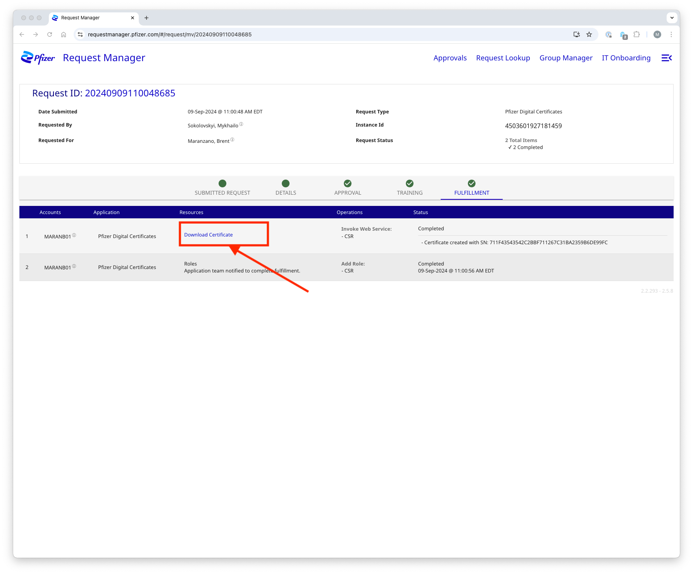
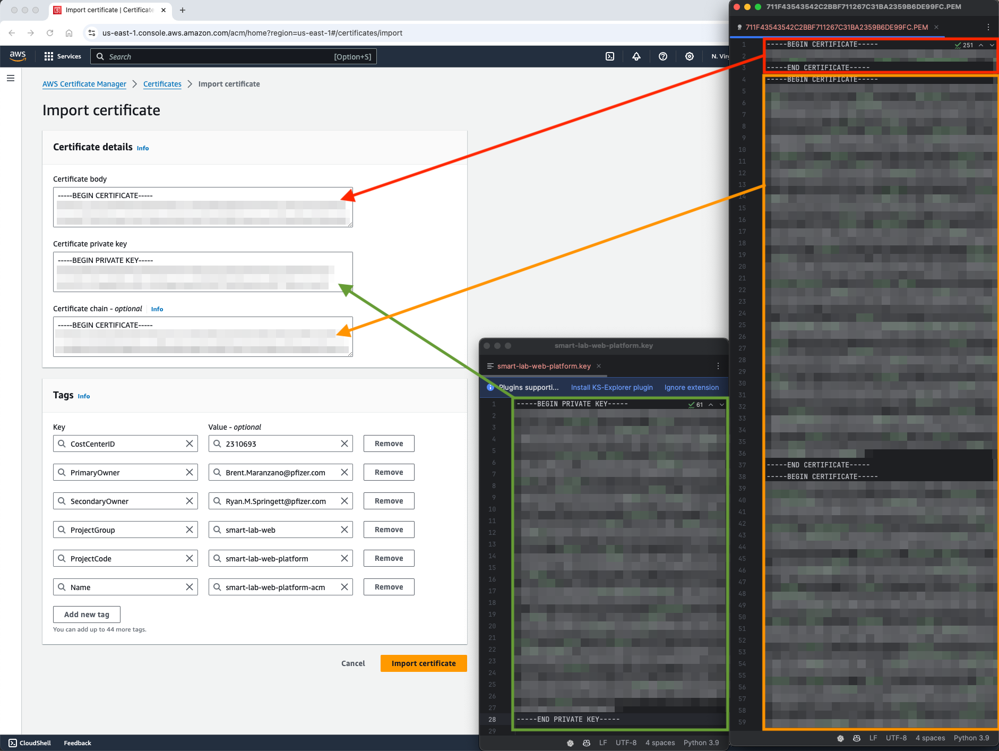
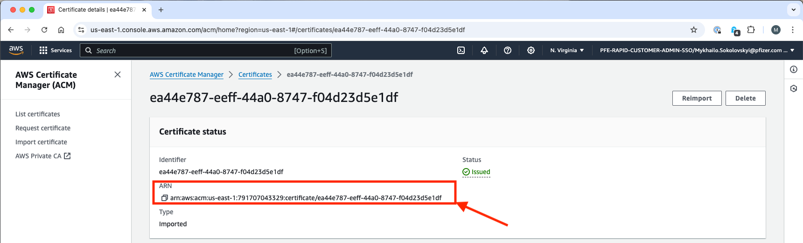
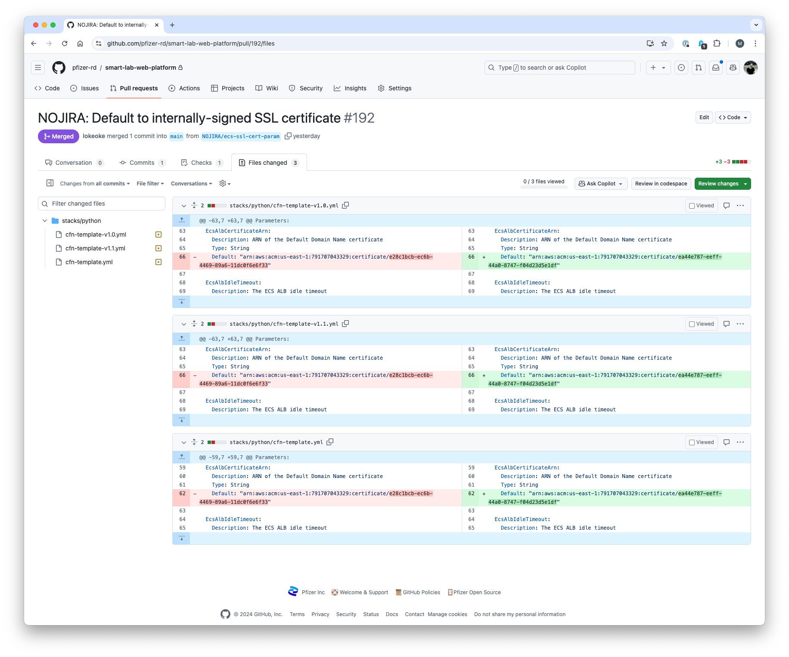

# Python Stack - DNS - Default Domain Name

It follows the pattern `https://internal-slw-<app-name>-<app-env>-<random-number>.<aws-region>.elb.amazonaws.com/`.

For example:

* http://internal-slw-uv-report-stage-537627479.us-east-1.elb.amazonaws.com/
* https://internal-slw-uv-report-uat-386803038.us-east-1.elb.amazonaws.com/

> [!IMPORTANT]
> The default domain name internally uses a wildcard self-signed SSL certificate issued for one year.

> [!CAUTION]
> The SSL certificate renewal is a manual process that has to be held on a regular basis.

## Issue a certificate

1. Generate a certificate signing request (CSR) using the following command:

    ```bash
    openssl req -new -newkey rsa:2048 -nodes -keyout smart-lab-web-platform.key -out smart-lab-web-platform.csr
    ```
   
   When prompted, enter the following information:


  
   > **NOTE:** Leave the `email` field blank. Additional information can also be left blank.


3. Fill in the form with the following information:

   | Key                   | Value                                                                                         |
   |-----------------------|-----------------------------------------------------------------------------------------------|
   | Requested For         | Demers, Jeremy                                                                                |
   | Request Type          | CSR                                                                                           |
   | Type of certification | TheSink SSL Certificate - Internal Only                                                       |
   | DNS Name              | `*.us-east-1.elb.amazonaws.com`                                                               |
   | CSR                   | Paste the content of your `smart-lab-web-platform.csr` file                                   |
   | Format                | PEM                                                                                           |
   | Owner                 | Demers, Jeremy                                                                                |
   | Support Emails        | `JeremySD99@gmail.com`, others that should receive expiration notification including yourself |

   

   Click `Submit`.

4. When the request is fulfilled, download the `.pem` certificate file.

   

5. Go to the [AWS Certiciate Manager (ACM)](https://us-east-1.console.aws.amazon.com/acm/home?region=us-east-1#/certificates/list) and click `Import`.

6. Fill in the form with the following information:

   | Key                     | Value                                                                           |
   |-------------------------|---------------------------------------------------------------------------------|
   | Certificate body        | Paste the first certificate from the `.pem` file downloaded on step 4           |
   | Certificate private key | Paste the content of your `smart-lab-web-platform.key` file generated on step 1 |
   | Certificate chain       | Paste the rest of the certificates from the `.pem` file downloaded on step 4    |

   > **IMPORTANT:** Always fill the tags accordingly.

    Tags:

   | Key            | Value                           |
   |----------------|---------------------------------| |

   | ProjectGroup   | smart-lab-web                   |
   | ProjectCode    | smart-lab-web-platform          |
   | Name           | smart-lab-web-uv-report-uat-acm |

   

   Click `Import certificate`.
   
7. Copy the certificate ARN.

   

8. Replace the `Default` value of the `EcsAlbCertificateArn` parameter in the python stack CloudFormation templates files with the new ARN.

   Values should be updated in all versions of the stack. At the moment the list is the following:
   - [cfn-template.yml](https://github.com/JeremyDemers/the-sink/blob/main/stacks/python/cfn-template.yml)
   - [cfn-template-v1.0.yml](https://github.com/JeremyDemers/the-sink/blob/main/stacks/python/cfn-template-v1.0.yml)
   - [cfn-template-v1.1.yml](https://github.com/JeremyDemers/the-sink/blob/main/stacks/python/cfn-template-v1.1.yml)

   Create a Pull Request and merge it.

   

> [!IMPORTANT]
> To start using the new certificate, the applications' stacks have to be updated.
> The update process is described in the [deployment](../../deploy) section.
