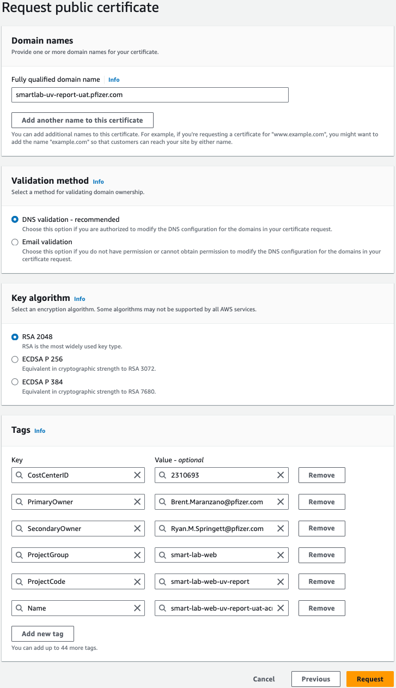

# Python Stack - DNS - Unique Domain Name

To make the application available via a pretty domain name, you'll need to follow the steps below.

It was agreed to use a subdomain of `thesink.com` to add a record only to the internal TheSink DNS server.

## Request a certificate

1. Go to the [AWS Certiciate Manager (ACM)](https://us-east-1.console.aws.amazon.com/acm/home?region=us-east-1#/certificates/list).

2. Click `Request`.

3. Leave the option `Request a public certificate` selected and hit `Next`.

4. Fill in the `Fully qualified domain name`. Use the pattern `smartlab-<app-name>-<app-env>.gmail.com` (e.g., `-uv-report-stage.thesink.com`, `-uv-report-uat.thesink.com`).

   > **IMPORTANT:**
   > Always fill the tags accordingly.

   The table below demonstrates an example for the `v-report-uat.thesink.com`:


   Please note that:
    * `ProjectCode` differs per application and follows the `smart-lab-web-<app-name>` pattern.
    * `Name` is different for each application and environment. Follows the `smart-lab-web-<app-name>-<app-env>-acm` pattern.

   

   Click `Request`.

5. Refresh the list of certificates until you see your new certificate in the list.

   

   Open the certificate details by clicking on the `Certificate ID`.

## Add DNS records

1. Create the file `DNS_External.txt` and fill it with the details of the certificate using the format from the example:

   ```text
   CNAME name = _36c2654f77d22cf353d45407b7eef48a.smartlab-uv-report-uat.thesink.com.
   CNAME value = _7f8c5b130cf48989cfde68fe84c45eb1.htgdxnmnnj.acm-validations.aws.
   ```

2. Create the file `DNS_Internal.txt` and fill it with the details of the certificate using the format from the example:

   ```text
   CNAME name = smartlab-uv-report-uat.thesink.com.
   CNAME value = -uv-report-uat-386803038.us-east-1.elb.amazonaws.com
   ```

   Note that the `CNAME value` is the domain name that was generated for your application.


   

   In the result of the search, choose `SUBMIT TICKET TO QUEUE`:

   

4. Create a ticket using the template below.

   `Describe your issue` = `Add record for DNS configuration of domains in RAPID account`

   For `Please provide a detailed description`:

    ```text
    Hello GBL-NETWORK DDI team,
    
    Please add the records from the attached files as described below:
    - Records from the `DNS_External.txt` to the external DNS server for certificate validation.
    - Records from the `DNS_Internal.txt` to the external DNS server to route the traffic.
    ```

   Don't forget to attach the files.

   

## Configure environment

> [!IMPORTANT]
> Proceed with this step only after receiving the confirmation from the `GBL-NETWORK` DDI team that the records were added.


   Add two values to the `Parameters` section of the file:

   ```
   "UniqueDomainNameCertificateArn": "arn:aws:acm:us-east-1:791707043329:certificate/d1180716-315c-4199-8f69-5cf8aa6037ed"
   ```

   The value of the `UniqueDomainName` should be the domain name you want to attach to the application.

   The value of `UniqueDomainNameCertificateArn` can be found on the certificate details page.

   


2. Create a Pull Request, merge it, and [deploy](../../deploy) the changes to the respective environment.
