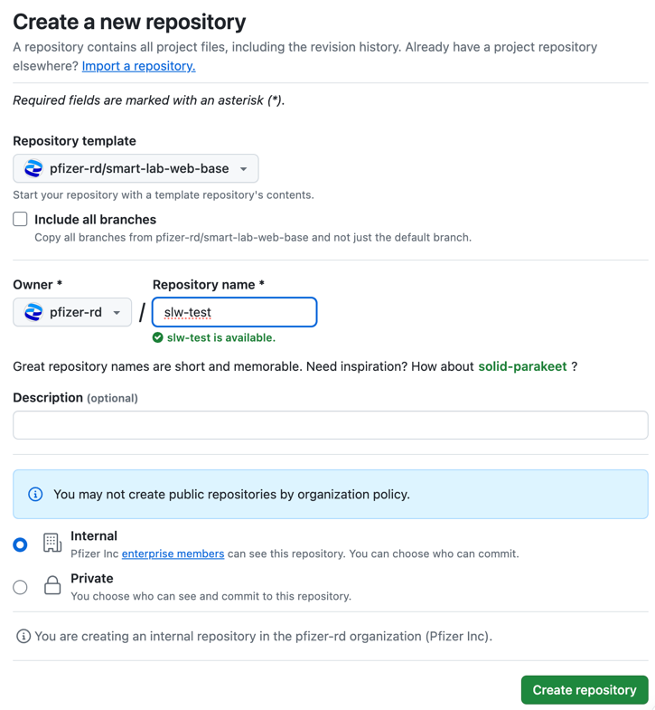

# Python Stack - Init

## Initialization for the new application

The `stage` environment must be provisioned first when initializing the new application.

1. Go to the https://github.com/JeremyDemers/the-sink and click on the `Use this template` button. In the dropdown select `Create a new repository`. 
   

2. This will open the new repository creation form. Ensure in TheSink R&D organization (https://github.com/JeremyDemers) is selected. Fill in the `Repository name` following the requirements:
   * It should be between 5 and 24 characters long.
   * It should start with `slw-`. 
   * While existing projects can continue using `the-sink`, new ones should use ``. 
   * It should not end with a hyphen.
   * It should contain only lowercase letters, numbers, and hyphens.

   Example: `test`.

   Fill in the `Description` field if necessary. Select the repository visibility that is appropriate for the project (`Internal` or `Private`). Click `Create repository` button.

   

3. Wait until the `CI/deploy` task is finished

   

   In case repository name is not following the requirements, the `CI/validate_repo_name` task will fail. By clicking on the `Details` link, you can see the error message and correct the repository name.

    

   Change the repository name and click on the `Re-run all jobs` button in the top right corner.

4. Go to https://github.com/JeremyDemers/the-sink/actions/workflows/stacks--init--python.yml and click `Run workflow`:

   

    * `The machine-name of the app` should equal the name on the newly created repository (e.g. `slw-test`).
    * `The machine-name of the app environment` keep the default value `stage`.
    * `The tag used for the app environment` keep the default value `latest`.
    * `Runtime Version` can be any, default is `3.12`.
    
   Initialization of the AWS CloudFormation stack will be started. The progress can be seen in the AWS Management Console.

   

   This DNS name can be used to access the application. To configure a more user-friendly domain name, please follow the [DNS](../dns) guide.

### Additional environments

The `stage` environment is the only mandatory requirement for your application in AWS. However, if your application requires multiple tiers to prevent active development changes from impacting real work in the lab, you can provision additional environments. These include `uat` (User Acceptance Testing) and `prod` (Production).

For instructions on initializing these additional environments, please refer to [Init additional environments](additional).
