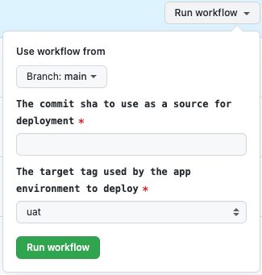
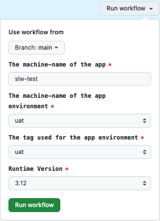

# Python Stack - Init additional environments

## Initialization of the additional environment for the application

Each application can have more than one environment. The standard list of environments allowed by the platform:

* `stage`
* `uat`
* `prod`

The environment `stage` is required and is the first environment provisioned for the application. Environments `uat` and `prod` can be provisioned in the later stages of the project. Unlike the `stage` environment, `uat` and `prod` will not be automatically updated with the latest changes from the `main` branch.

To initialize an additional environment follow the steps below.

1. In the repository of your project go to `Actions`->`Deploy` (e.g. https://github.com/JeremyDemers/the-sink/actions/workflows/deploy.yml) and click `Run workflow`:

   

    * `The commit sha to use as a source for deployment` copy the SHA of the commit from the `main` branch to specify the version to deploy (in most cases, it would be the latest commit).
    * `The target tag used by the app environment to deploy` select `uat` or `prod`.

   Wait until the task is finished.

2. Go to https://github.com/JeremyDemers/the-sink/actions/workflows/stacks--init--python.yml and click `Run workflow`:

   

    * `The machine-name of the app` should equal the name on the newly created repository (e.g. `slw-test`).
    * `The machine-name of the app environment` select `uat` or `prod`, should be the same as in step 1.
    * `The tag used for the app environment` should equal `The machine-name of the app environment`.
    * `Runtime Version` can be any, but keep it inline with the version used on `stage` (e.g. `3.12`).

   Initialization of the AWS CloudFormation stack will be started. The progress can be seen in the AWS Management Console.
