# GitHub Pull Request

A pull request is a proposal to merge a set of changes from one branch into another. In a pull request, collaborators can review and discuss the proposed set of changes before they integrate the changes into the main codebase. Pull requests display the differences, or diffs, between the content in the source branch and the content in the target branch.

Prerequisites:
- You are aware of how to work with `git` using CLI or `GitHub Desktop` application.

## Create a Pull Request

In the example below we will create an example pull request for the [SmartLab Web Base](https://github.com/JeremyDemers/the-sink) repository and will assign it for the review.

### Clone the repository

- Navigate to the [GitHub project URL](https://github.com/JeremyDemers/the-sink).
- Click on the `code` green button.
- Copy URL of the project.
  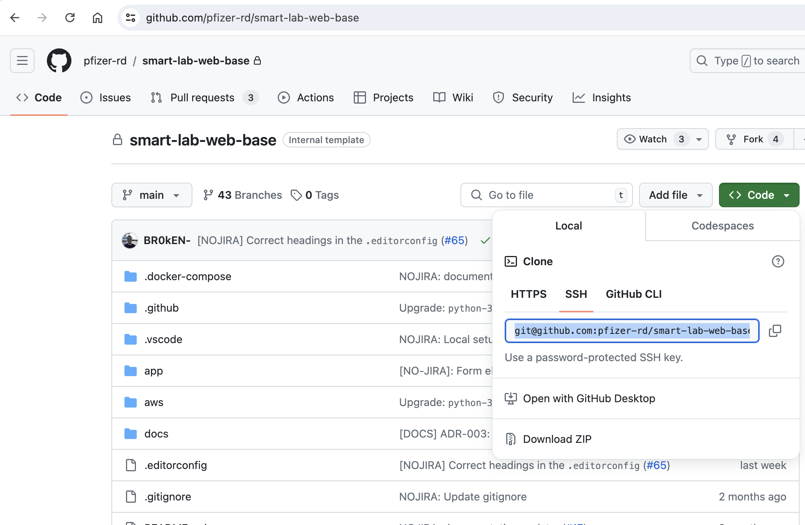
- Open terminal and navigate to your projects' directory.
- Clone the project.
  ```bash
  git clone git@github.com:JeremyDemers/the-sink.git
  ```

### Create a new branch

Create new git branch where we will push our changes. Make to follow branch naming best practices:
- **Descriptive**: Names should reflect the branch's purpose or task.
- **Concise**: Keep names short and to the point.
- **Consistent**: Follow established patterns to make it easy for team members to understand the role of each branch:
  - For new feature: `feature/add-processing-workflow-state`
  - For bug fix: `bugfix/fixed-processing-button-translation`
    ```bash
    git checkout -b feature/documentation-add-github-section
    ```

### Make your changes and push them into the repo

- Open project in the IDE or text editor and make changes.
- Review your changes:
  ```bash
  git status
  ```
  To see the diff:
  ```bash
  git diff <path-to-the-file>
  ```
- Add files to the commit:
  ```bash
  git add <path-to-the-file>
  ```
- Commit your changes, make sure to write meaningfully commit messages(avoid messages like `fixed a bug`), that may include:
  - What work did you complete?
  - Why did you do it?
  - What effect does it have on the code base?
  ```bash
  git commit -m "Added github section to the project documentation."
  ```
- Push your changes into your branch:
  ```bash
  git push origin feature/documentation-add-github-section
  ```

### Create pull request and make sure that lint checks have passed.

- Navigate to the [GitHub project URL](https://github.com/JeremyDemers/the-sink).
- Click on the `Pull requests` link in the header menu.
- Click on the `New pull request` green button.
  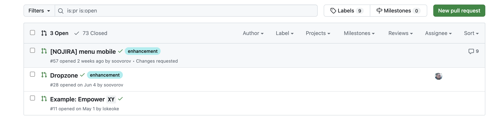
- In the input on the right side (source branch) select your branch (start typing to speed up the process).
- Input on the left side is a destination branch - where you want to merge your changes. Usually it's main.
  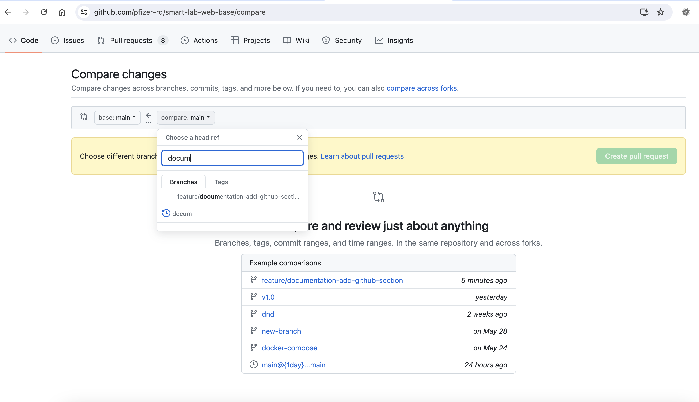
- On the next screen click on the `Create pull request` button.
- Add meaningful title, so everyone will be aware what this pull request about without open and reviewing it.
- Add description, if you need to provide any additional details.
  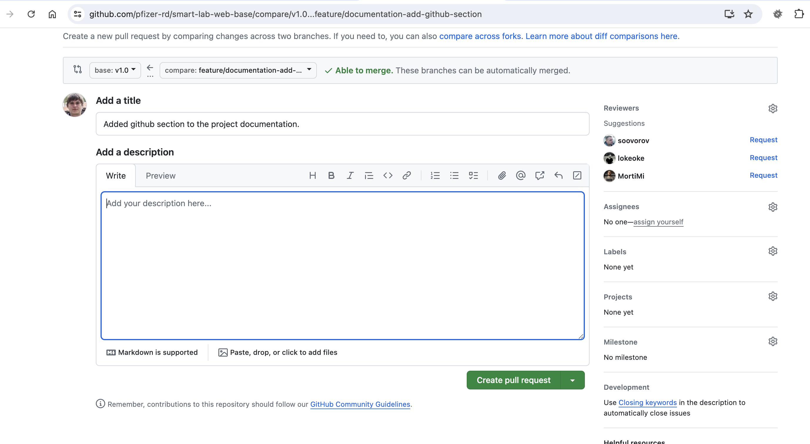
- Click on the `Create pull request` button.
- Wait for the checks to finish and make sure that **all checks have passed**. If some of them is not passing review the reason by clicking on the details link, address them push your changes to the same branch once again, they will automatically appear in your pull request, and trigger checks once again.
  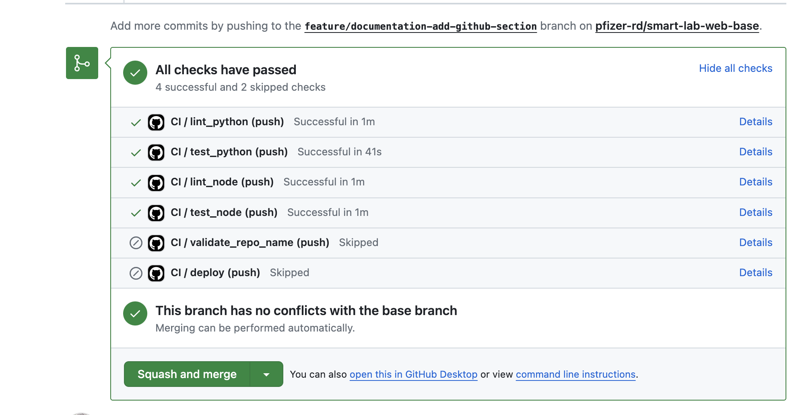

### Assign pull request for the review and address review comments.

Code review is an important step in the software development process to get a second opinion on the solution and implementation before it's merged into the main branch. To add reviewers to your pull request:

- Click on the gear icon on the right side of the page at the `Reviewers` section.
- Find the person(s) who would do your code review and click on its name.
  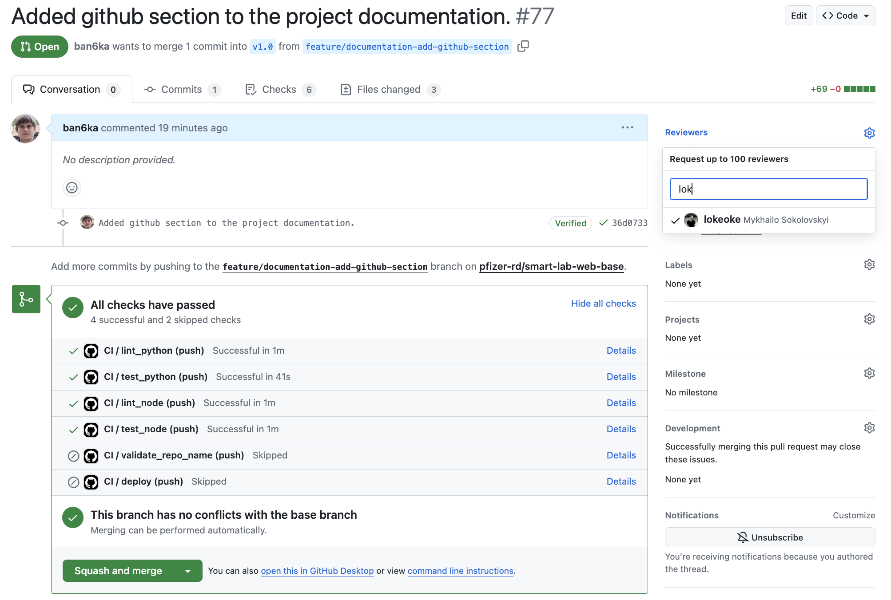
- After this reviewer will receive notification from the GitHub with a link to your pull request.

Once reviewers submitted their response, you will get notification from GitHub with one of the messages:

- Your changes have been approved, and code is ready to be merged.
- The `Reviewer` requested changes from you. This changes/questions/doubts will be listed on the pull request page:
  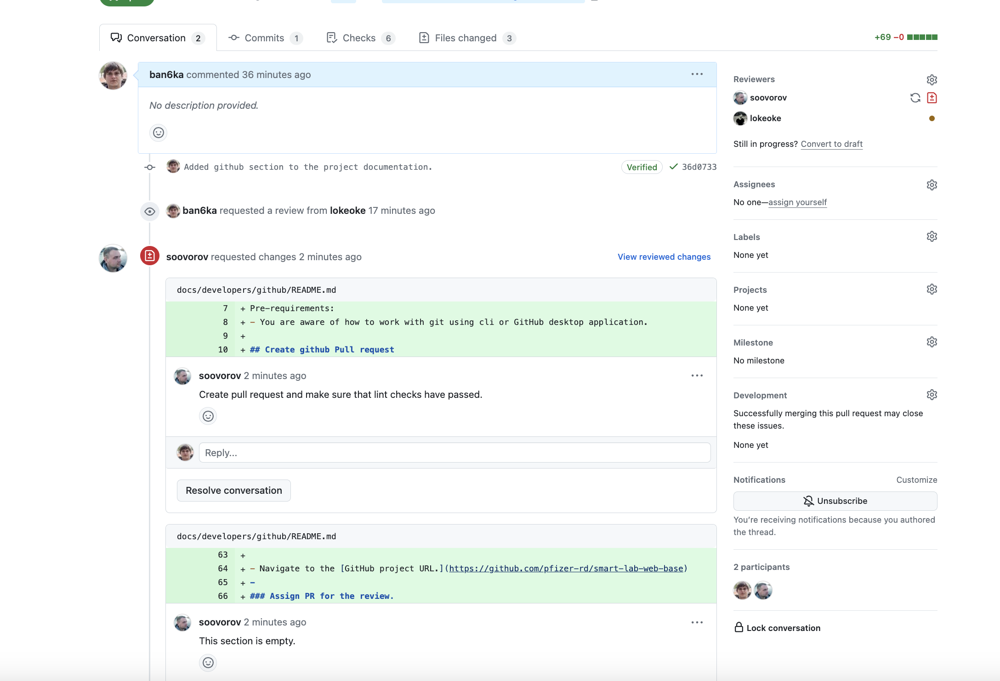
  - You have to either address them, by creating and pushing commits in to the same branch.
  - Convince the reviewer, that they are fine.
  - Once you will address them ask for code review once again to get an approval.

### Merge pull request

Pull request with at least one approval can be then merged. Pull request can have multiple commits dedicated to one specific feature or bug, we don't want them all to be merged into the destination branch as separate commits, rather to have them squashed into one. Select `Squash and merge` option in the merge button dropdown menu and click it to merge your changes:
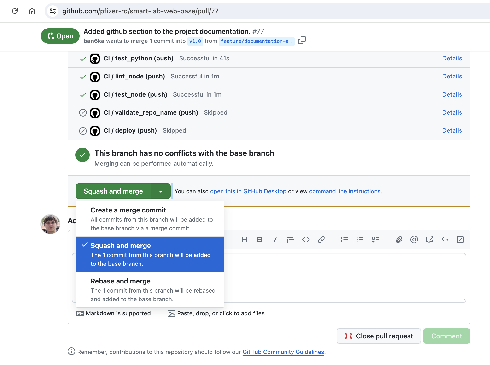

Your changes will be automatically scheduled for the deployment to the de environment and pull request will be closed.

## How to review pull request.

Once you will receive notification from the GitHub or someone will ask you to make a review of the pull request:
- Navigate to the pull request page.
- Click on the `Files changed` link:
  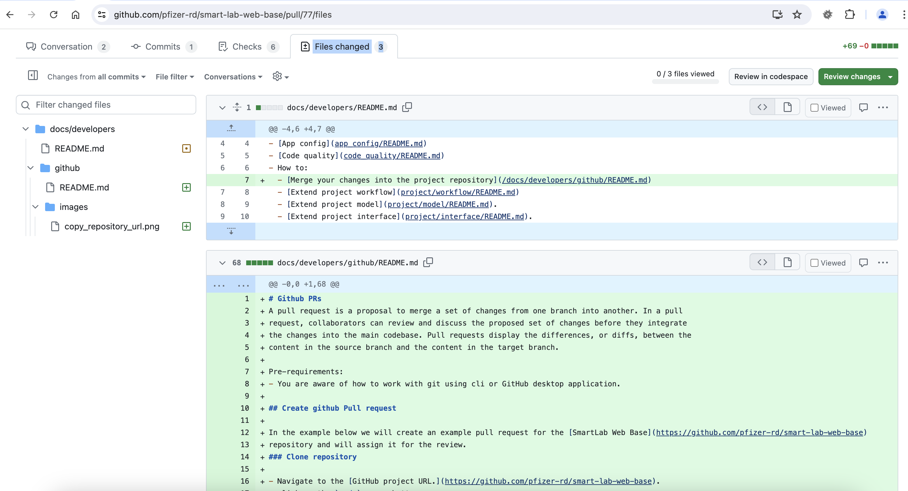
- Go through the code, and leave `comments` / `questions` / `propositions` if you have any:
  - Click on the `+` / `-` next to the line number near piece of code that you would like to comment
    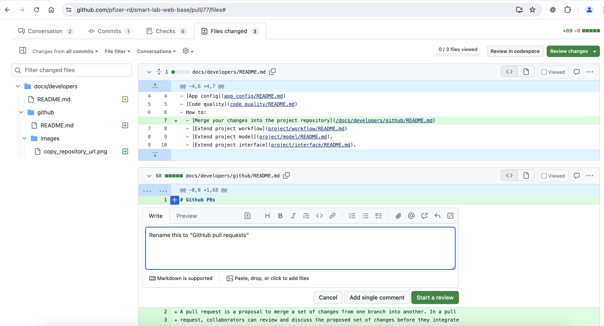
  - Click on the `Start a review` button.
- Once you've finished review, click on the `Review changes` green button at the top of the page, and select whether this PR is approved, or you want to request changes, or you don't have any opinion, and you want to just leave a comment.
  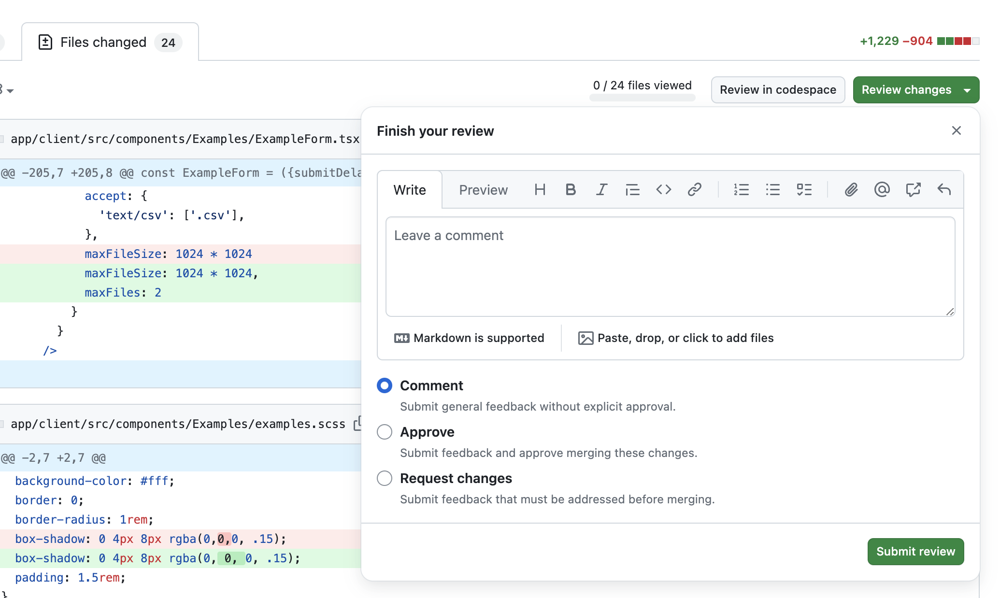
- Author of the pull request will receive notification that you have posted your review, all your review comments will be available on the pull request front page.
