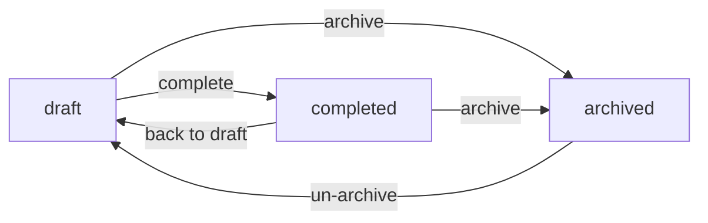

# Project Workflow

## Introduction

The project workflow is implemented using a status machine based on the [transitions library](https://github.com/pytransitions/transitions). The workflow for a project consists of various statuses and transitions. Each status represents a specific phase in the project's lifecycle, and transitions define how the project can move from one status to another. The main logic for handling these transitions is defined in the [WorkflowMixin](/app/server/src/api/models/mixins/workflow.py) class, which is then extended by the Project model.

### Project statuses and transitions

The Statuses enum defines the possible statuses in the project workflow. Transitions are defined using the `TransitionConfig` typed dictionary. Each transition specifies:

- `trigger`: the name of the event that will trigger transition.
- `source`: the status or list of statuses from which this transition can be triggered.
- `dest`: destination status to which the entity will transition.
- `conditions`: condition callback, that can be used to allow or disallow transition, [more information](https://github.com/pytransitions/transitions?tab=readme-ov-file#conditional-transitions)
- `unless`: behaves exactly like condition callback, but inverted.
- `before`: list of callbacks to execute before transition.
- `after`: list of callbacks to execute after transition.

More information on before and after callbacks can be found in the [official documentation](https://github.com/pytransitions/transitions?tab=readme-ov-file#callbacks-1)

### Existing project workflow

The project workflow includes the following statuses:

* `draft` - work-in-progress project, edits allowed
* `completed` - completed project, no edits allowed
* `archived` - archived or obsolete project, no edits allowed

Transitions between statuses are as follows:



## Customizing project workflow

Customization of the project workflow consists of two parts: backend Flask App and client React Application. Example bellow shows how to add the `processing` workflow status.

### Backend

Define new statuses and corresponding transitions in the [Projects model](/app/server/src/api/models/project.py):

#### Modify `Statuses` enum to add new statuses or delete an old ones.

> [!NOTE]
> - `archived` status is reserved and shouldn't be deleted.
> - `draft` status is set by default for all new projects, so if it has to be deleted you should assign new status in the `get_workflow_initial_status` method.

```python
class Statuses(Enum):
    """The project workflow statuses enum."""
    # ...existing statuses
    PROCESSING = "processing"    
```

#### Add new transition objects in the `get_workflow_transitions` method.

Add new transition objects in the `get_workflow_transitions` method, for the new statuses and remove redundant transitions is source/destination status has been deleted. 

Define transition callbacks in case you need to execute extra actions on the workflow status change.

**Best practice:** add logger functionality to your callbacks, it will help to troubleshoot issues with the third party services or to blame who did when to the project.

```python
class Project(EntityMixin, WorkflowMixin, metaclass=ProjectMeta):
    # Existing methods and properties...
    def get_workflow_transitions(self) -> list[TransitionConfig]:
        return [
            # ...existing transition definitions
            # Allow transition from processing to complete status.
            TransitionConfig(
                trigger="complete",
                source=Statuses.PROCESSING.value,
                dest=Statuses.COMPLETED.value,
                after=[self.log_transition]
            ),
            # Allow transition from draft to processing status.
            TransitionConfig(
                trigger="processing",
                source=Statuses.DRAFT.value,
                dest=Statuses.PROCESSING.value,
                # Define new method workflow_process_project in this class, see example below.
                before=[self.workflow_process_project],
                after=[self.log_transition]
            ),
        ]
        
    def workflow_process_project(self, **kwargs: dict[str, Any]) -> None:
        """Sample callback that will be triggered when project status will change to processing."""
        # Execute API call, trigger specific calculations, or any other action that is needed.
        # my_fancy_utility_function_that_triggers_calculations(self)
```

### Client

#### Modify `Statuses` enum to add new statuses or delete an old ones.

Lift and shift your changes done to the Statuses enum in the project model into [client enum](/app/client/src/models/Project/constants.ts):

```typescript
export const ProjectStatus = {
  // ...exising statuses
  Processing: 'processing',
} as const;
```

#### Add icon [optional]

Icons with the new status will be added to the button and status.

```html
<!-- Status --->
<div class="status">
  Status:
  <div ...>
    <i class="font-icon-processing status-processing icon-m"></i>
  </div>
</div>
<!-- Transition button --->
<button ...>
  <i class="font-icon-process"></i>
  Processing
</button>
```

To make the icon appear before the button, you need to add a status definition to the [icons](/app/client/src/scss/abstract/_icons.scss).

```scss
// '\e926' is a code of generated icon ('Reset' icon in this case)
$font-icons: (
  // ...exising icons
  process: '\e926',
  processing: '\e926',
);
```

Manage icon color can be done in the following [style file](/app/client/src/scss/components/_site-header.scss).

```scss
.status {
  // ...existing statuses
  &-processing {
    color: $c-blue-sky;
  }
}
```

**Note:** Project color variables are stored in [_variables.scss](/app/client/src/scss/abstract/_variables.scss).

More details about the Icons management can be found in this [section](../interface#icons-management).

### Update project model [optional]

Review [Project.canBeEdited](/app/client/src/models/Project/ProjectModel.ts) in case new project workflow should allow edits in a different statuses than draft.

In the example bellow we are allowing to edit the fields on the add/edit forms if a project is in the `Draft` or `Processing` status.

```typescript
class ProjectModel extends BaseModel<Project.Model, Project.ModelListItem, Project.Filters> {
  // Existing methods and properties...
  canBeEdited = (project: Project.Model): boolean => (
    this.isNew(project)
    || [ProjectStatus.Draft, ProjectStatus.Processing].includes(project.status)
  );
}
```

Make sure to run code linters and to adjust project test cases, described in [this section](../../code_quality).
